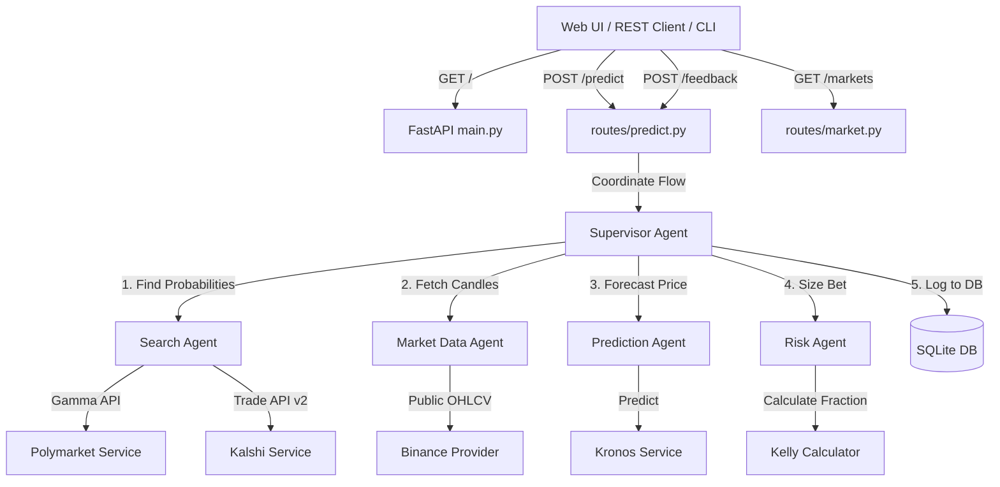

# Multi-Agent Crypto Prediction Research System Architecture

This document provides a comprehensive breakdown of the design patterns, data models, agent behaviors, forecasting mechanics, and execution steps implemented in the Crypto Prediction Research System.

---

## 1. System Architecture Overview

The system is designed around **Clean Architecture principles**, strictly isolating the external data layers, database storage, prediction model orchestration, and the REST API. 



---

## 2. Component Directory Structure

```
d:\CWT prediction/
├── .agents/                    # Workspace configuration root for Hermes Agent
├── crypto_prediction/          # Core python package
│   ├── agents/                 # Multi-Agent orchestrators and coordinators
│   │   ├── feedback_agent.py   # Compiles metrics and performance feedback
│   │   ├── market_data_agent.py# Coordinates OHLCV market fetching
│   │   ├── prediction_agent.py # Interfaces with the Kronos transformer model
│   │   ├── risk_agent.py       # Sizes recommendations using Kelly Criterion
│   │   ├── search_agent.py     # Pulls odds from Polymarket & Kalshi
│   │   └── supervisor.py       # Coordinates sequencing and AIAgent reasoning
│   ├── database/               # Data access and SQLAlchemy schema layer
│   │   ├── models.py           # Declares Market, Prediction, Feedback, and Stats models
│   │   └── repository.py       # Handles transactional CRUD with selectinload eager-loading
│   ├── prediction/             # Deep learning layer
│   │   ├── Kronos/             # Submodule: Shiyu-coder/Kronos foundation model
│   │   └── kronos_service.py   # Tokenizer setup, model loaders, and Mock fallbacks
│   ├── providers/              # Market data feed abstraction layer
│   │   ├── base.py             # Defines abstract MarketDataProvider
│   │   └── binance_provider.py # Fetches Binance historical candles with retry logic
│   ├── routes/                 # FastAPI REST Controllers
│   │   ├── health.py           # Basic health checks
│   │   ├── market.py           # Endpoint for querying external prediction markets
│   │   └── predict.py          # Prediction execution, history logs, and outcome feedback
│   ├── schemas/                # Pydantic schema validation & configurations
│   ├── templates/              # HTML / CSS Web UI resources
│   └── main.py                 # FastAPI Application bootstrap entry point
├── run_prediction.py           # Command line runner interface
└── tests/                      # Pytest unit testing suite
```

---

## 3. Deep Technical Specifications

### 3.1 Data Persistence Layer (`crypto_prediction/database/`)
- **Repository Pattern**: `PredictionRepository` decouples the database engine operations from the rest of the application. 
- **Async Session Management**: Implemented using `SQLAlchemy`'s `AsyncSessionLocal` engine.
- **Eager Loading**: To resolve async lazy loading exceptions, relationship queries are eager-loaded with `selectinload(DBPrediction.feedbacks)`.
- **Entities**:
  - `DBMarket`: Cache for Polymarket/Kalshi question probabilities.
  - `DBPrediction`: Logs prediction variables (direction, confidence, market odds, Kelly sizing, narrative text).
  - `DBFeedback`: Links prediction outcomes to actual movements to evaluate accuracy.
  - `DBStatistics`: Keeps running accuracy levels, correct prediction counts, and total runs.

### 3.2 Forecasting Model Integration (`crypto_prediction/prediction/`)
- **Model Family**: Built on the **shiyu-coder/Kronos** foundation time-series transformer.
- **Hardware Acceleration**: Auto-detects and uses GPU architectures (`cuda:0` / `mps` for macOS) with fallback to `cpu`.
- **Robust Model Loading**: Loads tokenizer and model weights from the Hugging Face hub safely (`NeoQuasar/Kronos-Tokenizer-base` and `NeoQuasar/Kronos-small`).
- **Dynamic & Trend-Biased Fallback**: A configurable mock predictor (`USE_MOCK_PREDICTOR=True` / `False`) is provided. It computes the trend of the last 10 candles, adds a dynamic seed using the asset's price, and biases the forecast return distributions accordingly.

### 3.3 Position Sizing Layer (`crypto_prediction/risk/`)
- **Binary Sizing Kelly Formula**:
  - Odds ($b$) derived as: $b = \frac{1 - m_p}{m_p}$
  - Optimal capital allocation fraction: $f^* = \frac{p \cdot b - q}{b} = \frac{p - m_p}{1 - m_p}$
  - *Where:* $p$ is model probability, $q = 1 - p$, and $m_p$ is prediction market probability.
  - **Risk mitigation**: Scaled down using a `0.5` half-Kelly multiplier.

### 3.4 Multi-Agent Coordination Flow (`crypto_prediction/agents/`)
- **Supervisor Agent**: Superintends the sequential pipeline steps and passes research variables to the Hermes **`AIAgent`** to produce the reasoning commentary.
- **Hermes Agent Integration**:
  - Requires a model with a context window of at least **64k tokens** (satisfied by `google/gemini-flash-1.5-free` via OpenRouter).
  - Prompts are dynamically contextualized with asset pricing data, predicted momentum, market odds, and Kelly suggestions to write the mathematical edge overview.

---

## 4. REST & CLI Usage Guidelines

### 4.1 CLI Execution
Run the CLI runner script directly:
```bash
$env:PYTHONPATH="d:\CWT prediction" ; C:\Users\ag065\AppData\Local\Programs\Python\Python311\python.exe run_prediction.py --symbol BTCUSDT --interval 5m
```

### 4.2 Start API server
```bash
$env:PYTHONPATH="d:\CWT prediction" ; C:\Users\ag065\AppData\Local\Programs\Python\Python311\python.exe -m crypto_prediction.main
```

### 4.3 REST Request Examples
- **Predict** (`POST /predict`):
  ```json
  {"symbol": "BTCUSDT", "interval": "5m", "limit": 1000}
  ```
- **Feedback** (`POST /feedback`):
  ```json
  {"prediction_id": 18, "actual_movement": "UP"}
  ```
