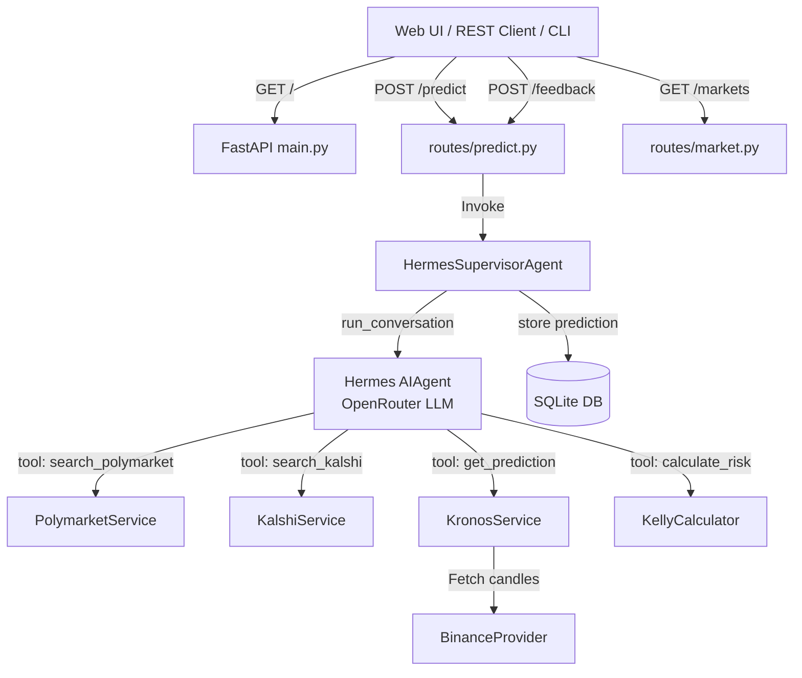

# Multi-Agent Crypto Prediction Research System Architecture

This document provides a comprehensive breakdown of the design patterns, data models, agent behaviors, forecasting mechanics, and execution steps implemented in the Crypto Prediction Research System.

---

## 1. System Architecture Overview

The system is designed around **Clean Architecture principles**, strictly isolating the external data layers, database storage, prediction model orchestration, and the REST API. Orchestration is driven by the **NousResearch Hermes Agent Framework**.



**Key principle**: Hermes only orchestrates. All business logic — Binance fetching, Kronos prediction, Kelly calculation, database operations — stays in the original providers, services, and repository. Hermes tools are thin wrappers that delegate to these modules.

---

## 2. Component Directory Structure

```
d:\CWT prediction/
├── crypto_prediction/              # Core python package
│   ├── hermes/                     # Hermes Agent Framework integration
│   │   ├── __init__.py             # Bootstraps Hermes path, imports all tools/agents
│   │   ├── hermes_bootstrap.py     # Adds Hermes framework to sys.path
│   │   ├── memory.py               # HermesMemory - prediction history for context
│   │   ├── supervisor.py           # HermesSupervisorAgent - orchestrates pipeline
│   │   ├── tools/                  # Hermes-registered tool wrappers
│   │   │   ├── market_data_tool.py        # get_market_data → BinanceProvider
│   │   │   ├── prediction_tool.py         # get_prediction → KronosService
│   │   │   ├── risk_tool.py               # calculate_risk → KellyCalculator
│   │   │   ├── search_polymarket_tool.py  # search_polymarket → PolymarketService
│   │   │   ├── search_kalshi_tool.py      # search_kalshi → KalshiService
│   │   │   └── feedback_tool.py           # save_feedback → PredictionRepository
│   │   └── agents/                 # Hermes agent definitions
│   │       ├── search_agent.py       # HermesSearchAgent
│   │       ├── market_data_agent.py  # HermesMarketDataAgent
│   │       ├── prediction_agent.py   # HermesPredictionAgent
│   │       ├── risk_agent.py         # HermesRiskAgent
│   │       └── feedback_agent.py     # HermesFeedbackAgent
│   ├── database/                   # Data access and SQLAlchemy schema layer
│   │   ├── models.py               # Market, Prediction, Feedback, Statistics
│   │   └── repository.py           # Async CRUD with selectinload eager-loading
│   ├── prediction/                 # Deep learning layer
│   │   ├── Kronos/                 # Submodule: Kronos foundation model
│   │   └── kronos_service.py       # Tokenizer, model loaders, Mock fallback
│   ├── providers/                  # Market data feed abstraction
│   │   ├── base.py                 # Abstract MarketDataProvider
│   │   └── binance_provider.py     # Binance OHLCV with retry logic
│   ├── services/                   # Prediction market API clients
│   │   ├── polymarket.py           # Gamma API client
│   │   └── kalshi.py               # Trade API v2 client
│   ├── risk/                       # Position sizing
│   │   └── kelly.py                # Kelly Criterion calculator
│   ├── routes/                     # FastAPI REST Controllers
│   │   ├── health.py               # GET /health
│   │   ├── market.py               # GET /markets
│   │   └── predict.py              # POST /predict, GET /history, POST /feedback, GET /statistics
│   ├── schemas/                    # Pydantic config (Settings)
│   ├── templates/                  # HTML dashboard (index.html)
│   ├── utils/                      # logger, helpers (retry)
│   └── main.py                     # FastAPI bootstrap
├── run_prediction.py               # CLI runner
└── tests/                          # Pytest suite
    ├── test_system.py              # Kelly, Binance, Hermes agent execution tests
    └── test_hermes.py              # Hermes tool schemas, agents, memory, supervisor tests
```

---

## 3. Deep Technical Specifications

### 3.1 Hermes Framework Integration (`crypto_prediction/hermes/`)

#### Tool Registration
Each tool file calls `tools.registry.register()` at module import time with an OpenAI-format function schema, a handler function, and a toolset name. Example:

```
market_data_tool.py
  registry.register(
      name="get_market_data",
      toolset="crypto_market_data",
      schema={...},
      handler=_market_data_handler,  # calls BinanceProvider.get_klines()
      is_async=True,
  )
```

Six tools are registered — one per external service. Tools contain **zero business logic**; they delegate entirely to the existing providers, services, risk calculator, and repository.

#### Agent Tool Isolation
Each agent class restricts which tools it may invoke:

| Hermes Agent | Allowed Tools |
|---|---|
| `HermesSearchAgent` | `search_polymarket`, `search_kalshi` |
| `HermesMarketDataAgent` | `get_market_data` |
| `HermesPredictionAgent` | `get_prediction` |
| `HermesRiskAgent` | `calculate_risk` |
| `HermesFeedbackAgent` | `save_feedback` |

No agent has access to tools outside its responsibility.

#### Orchestration Flow (HermesSupervisorAgent)

The prediction pipeline runs entirely inside a true agentic conversation loop driven by `AIAgent.run_conversation(prompt)`:

```
1. supervisor.execute_prediction_flow(symbol, interval, limit)
   → Construct agentic prompt containing symbol, interval, and parsed asset name.
   → Invoke agent.run_conversation(prompt) with the "crypto-prediction" toolset.
   
2. AIAgent ReAct Loop (Autonomous Tool Execution)
   → Choose and call search_polymarket and search_kalshi to scan prediction markets.
   → Choose and call get_prediction to forecast price movement.
     → get_prediction fetches Binance klines internally and runs Kronos inference.
   → Choose and call calculate_risk to compute Kelly sizing based on model and market odds.
   
3. Trajectory Parsing and Execution State Extraction
   → Loop through response["messages"] to identify tool outputs and assistant parameters.
   → Extract:
     a. direction, confidence, model_probability (from get_prediction tool response)
     b. market_probability (from calculate_risk tool call arguments)
     c. kelly_fraction (from calculate_risk tool response)
     d. reasoning (from assistant's reasoning_content and text blocks)
     
4. repo.save_prediction() → stores prediction entry to SQLite DB
5. memory.add_prediction() → updates HermesMemory with the current run details
```

#### Error Handling and Fallbacks
- The supervisor runs in a `try/except` block with execution-time logging.
- If the agent loop fails or OpenRouter credentials/credits are depleted before completing, the supervisor falls back to extracting whatever partial tool executions occurred in the conversation history, defaulting missing values gracefully (e.g. `market_probability=0.5` or `prediction=NONE`).
- Internal network/API failures inside any tool are packaged as standard JSON errors inside the tool response, allowing the agent to reason about the error and continue.

### 3.2 Hermes Memory (`crypto_prediction/hermes/memory.py`)

Stores historical prediction context for LLM reasoning — does NOT store raw OHLCV.

**Per-prediction entry:**
```
{
    symbol, interval,
    prediction_direction, confidence,
    model_probability, market_probability,
    kelly_fraction, market_disagreement,
    reasoning, accuracy (optional), timestamp
}
```

Maximum 20 entries by default. Passed into `AIAgent.run_conversation()` prompt for context-aware reasoning.

### 3.3 Forecasting Model Integration (`crypto_prediction/prediction/`)
- **Model Family**: Built on the **Kronos** foundation time-series transformer.
- **Hardware Acceleration**: Auto-detects GPU (`cuda:0` / `mps`) with CPU fallback.
- **Robust Model Loading**: Loads tokenizer and model weights from Hugging Face hub (`NeoQuasar/Kronos-Tokenizer-base`, `NeoQuasar/Kronos-small`).
- **Mock Predictor**: Configurable fallback (`USE_MOCK_PREDICTOR=True`) with trend-biased synthetic forecasts.

### 3.4 Position Sizing (`crypto_prediction/risk/kelly.py`)
- **Binary Kelly Formula**:
  - If `model_prob > market_prob`: $f^* = \frac{p - m_p}{1 - m_p}$ (YES/UP)
  - If `model_prob < market_prob`: $f^* = \frac{m_p - p}{m_p}$ (NO/DOWN)
  - Half-Kelly multiplier (`0.5`) applied for risk mitigation.
- **Risk levels**: `NONE` (0%), `LOW` (<5%), `MEDIUM` (<15%), `HIGH` (≥15%).

### 3.5 Data Persistence Layer (`crypto_prediction/database/`)
- **Repository Pattern**: `PredictionRepository` decouples DB operations from application logic.
- **Async Session**: SQLAlchemy `AsyncSessionLocal` engine.
- **Eager Loading**: `selectinload(DBPrediction.feedbacks)` for relationship queries.
- **Entities**:
  - `DBMarket`: Cache for Polymarket/Kalshi probabilities.
  - `DBPrediction`: Direction, confidence, market odds, Kelly, reasoning.
  - `DBFeedback`: Links predictions to actual movements.
  - `DBStatistics`: Running accuracy, correct/total counts.

---

## 4. Hermes Tool → Existing Module Mapping

| Hermes Tool | Registry Name | Module Called | File |
|---|---|---|---|
| Market Data | `get_market_data` | `BinanceProvider.get_klines()` | `providers/binance_provider.py` |
| Prediction | `get_prediction` | `predict_next_movement()` | `prediction/kronos_service.py` |
| Risk | `calculate_risk` | `KellyCalculator.calculate()` | `risk/kelly.py` |
| Polymarket Search | `search_polymarket` | `PolymarketService.get_active_markets(query=...)` | `services/polymarket.py` |
| Kalshi Search | `search_kalshi` | `KalshiService.get_active_markets(query=...)` | `services/kalshi.py` |
| Feedback | `save_feedback` | `PredictionRepository.save_feedback()` | `database/repository.py` |

---

## 5. REST & CLI Usage Guidelines

### 5.1 CLI Execution
```bash
$env:PYTHONPATH="d:\CWT prediction" ; C:\Users\ag065\AppData\Local\Programs\Python\Python311\python.exe run_prediction.py --symbol BTCUSDT --interval 5m
```

### 5.2 Start API Server
```bash
$env:PYTHONPATH="d:\CWT prediction" ; C:\Users\ag065\AppData\Local\Programs\Python\Python311\python.exe -m crypto_prediction.main
```

### 5.3 REST Request Examples
- **Predict** (`POST /predict`):
  ```json
  {"symbol": "BTCUSDT", "interval": "5m", "limit": 1000}
  ```
- **Feedback** (`POST /feedback`):
  ```json
  {"prediction_id": 18, "actual_movement": "UP"}
  ```
