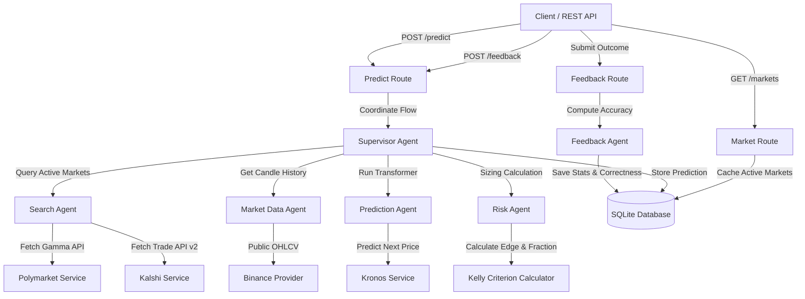

# Crypto Prediction Research System

A production-quality Python backend multi-agent system designed to research crypto markets, predict price direction movements using **Kronos**, and determine optimal risk position sizes using the **Kelly Criterion**.

---

## Architecture Diagram



---

## Features

- **Multi-Agent Coordination**: Fully automated agent flow supervised by a orchestrating Agent.
- **Kronos Foundation Model**: Price movement prediction leveraging a state-of-the-art candlestick foundation model, with automatic hardware detection (CUDA/MPS/CPU fallbacks).
- **Kelly Criterion**: Dynamic risk calculation that evaluates mathematical edge of predictions over market odds.
- **Provider & Repository Abstractions**: Strictly decoupled architecture applying Solid principles, Repository pattern, and clean interfaces.
- **Resilient Request Execution**: Exponential backoff retry logic handling 429 rate-limiting, 5xx server errors, and network timeouts.

---

## Installation & Setup

### Prerequisites
- Python 3.12+
- PyTorch (configured for your hardware CPU/GPU)

### Step 1: Install Dependencies
```bash
pip install -r requirements.txt
```

### Step 2: Set Environment Variables
Create a `.env` file based on `.env.example`:
```env
OPENROUTER_API_KEY=your-api-key-here
MODEL_NAME=meta-llama/llama-3-8b-instruct:free
DATABASE_URL=sqlite+aiosqlite:///crypto_prediction.db
LOG_LEVEL=INFO
PORT=8000
HOST=0.0.0.0
```

---

## Running the Application

### Start API Server
```bash
python -m crypto_prediction.main
```
Or run using uvicorn directly:
```bash
uvicorn crypto_prediction.main:app --port 8000 --reload
```

---

## REST API Endpoints

### 1. Health Check
`GET /health`
```bash
curl http://localhost:8000/health
```
Response:
```json
{"status": "healthy"}
```

### 2. Search active markets
`GET /markets`
Queries Polymarket and Kalshi APIs, stores matching markets in the database, and returns the normalized list.
```bash
curl http://localhost:8000/markets
```

### 3. Run prediction pipeline
`POST /predict`
Inputs target asset and candlestick settings, executes data retrieval, model inference, risk calculation, and returns results.
```bash
curl -X POST http://localhost:8000/predict \
  -H "Content-Type: application/json" \
  -d '{"symbol": "BTCUSDT", "interval": "5m", "limit": 1000}'
```
Response:
```json
{
  "prediction_id": 1,
  "symbol": "BTCUSDT",
  "prediction": "UP",
  "confidence": 0.83,
  "market_probability": 0.61,
  "kelly": 0.18,
  "reasoning": "Kronos predicts next price movement is UP..."
}
```

### 4. History
`GET /history`
Returns prediction records stored in the database.
```bash
curl http://localhost:8000/history
```

### 5. Submit feedback
`POST /feedback`
Evaluates a prediction against actual market outcomes, saves accuracy metrics and outputs updated run-time stats.
```bash
curl -X POST http://localhost:8000/feedback \
  -H "Content-Type: application/json" \
  -d '{"prediction_id": 1, "actual_movement": "UP"}'
```

---

## Testing

Run unit tests using pytest:
```bash
pytest
```
